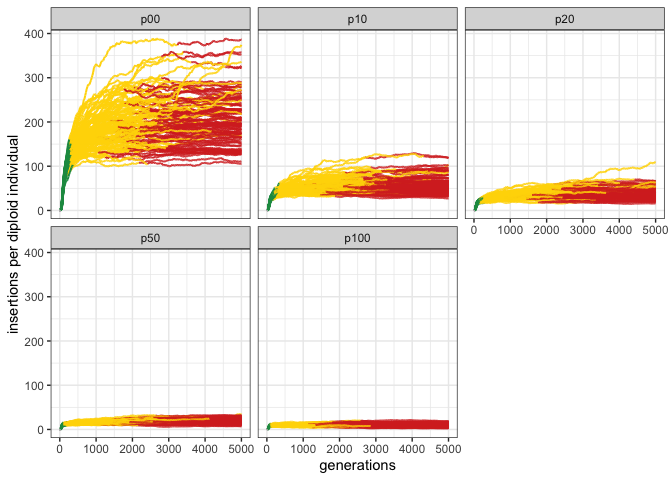
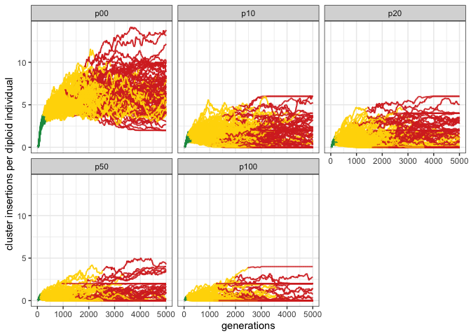
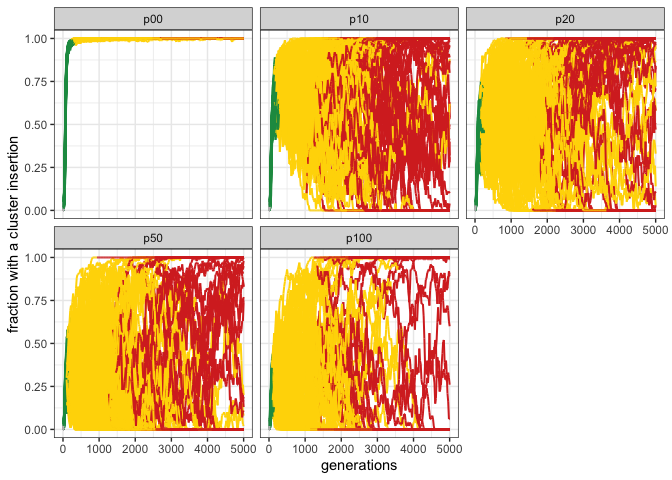
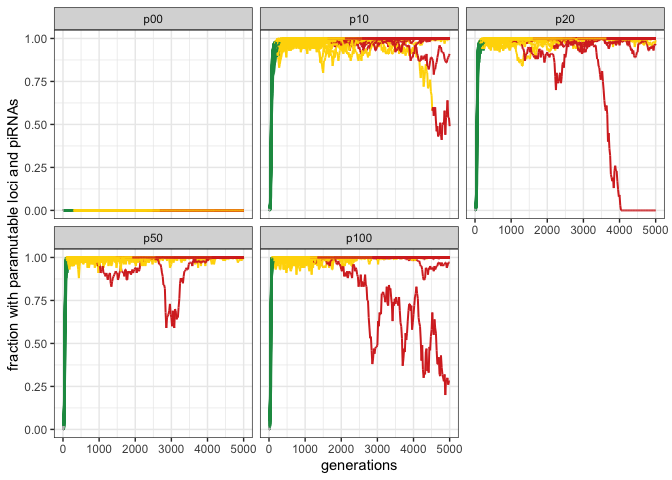
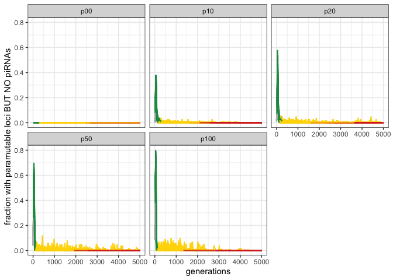
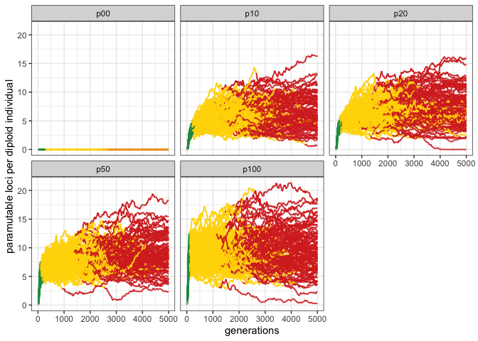
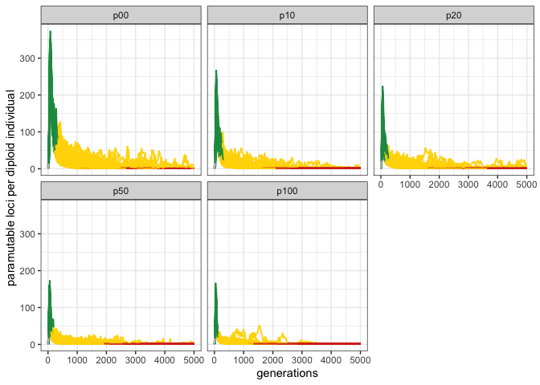

para-report
================

# Simulating

``` bash
folder="explore-para"
tool="/Users/vetgrid22/rokofler/2022-paramutations/2022-07-explore/invadego_v021"
mkdir $folder

$tool --N 1000 --gen 5000 --genome mb:10,10,10,10,10 --cluster kb:300,300,300,300,300 --rr 4,4,4,4,4 --rep 100 --steps 20 -u 0.1 --basepop 100 --sampleid p00 > $folder/p00 &
$tool --N 1000 --gen 5000 --genome mb:10,10,10,10,10 --cluster kb:300,300,300,300,300 --rr 4,4,4,4,4 --rep 100 --steps 20 -u 0.1 --basepop 100 --paramutation 10:0 --sampleid p10 > $folder/p10 &
$tool --N 1000 --gen 5000 --genome mb:10,10,10,10,10 --cluster kb:300,300,300,300,300 --rr 4,4,4,4,4 --rep 100 --steps 20 -u 0.1 --basepop 100 --paramutation 10:0,1 --sampleid p20 > $folder/p20 &
$tool --N 1000 --gen 5000 --genome mb:10,10,10,10,10 --cluster kb:300,300,300,300,300 --rr 4,4,4,4,4 --rep 100 --steps 20 -u 0.1 --basepop 100 --paramutation 2:0 --sampleid p50 > $folder/p50 &
$tool --N 1000 --gen 5000 --genome mb:10,10,10,10,10 --cluster kb:300,300,300,300,300 --rr 4,4,4,4,4 --rep 100 --steps 20 -u 0.1 --basepop 100 --paramutation 1:0 --sampleid p100 > $folder/p100 &
```

## merge

``` bash
cat p* |grep -v "^Invade"|grep -v "^#" > data-for.r
```

# Invasion dynamics

## Average TE copy numbers

``` r
library(tidyverse)
```

    ## ── Attaching packages ─────────────────────────────────────── tidyverse 1.3.1 ──

    ## ✔ ggplot2 3.3.6     ✔ purrr   0.3.4
    ## ✔ tibble  3.1.7     ✔ dplyr   1.0.9
    ## ✔ tidyr   1.2.0     ✔ stringr 1.4.0
    ## ✔ readr   2.1.2     ✔ forcats 0.5.1

    ## ── Conflicts ────────────────────────────────────────── tidyverse_conflicts() ──
    ## ✖ dplyr::filter() masks stats::filter()
    ## ✖ dplyr::lag()    masks stats::lag()

``` r
library(RColorBrewer)
theme_set(theme_bw())
p6<-c("grey","#1a9850","#ffd700","#d73027") # gold

d<-read_delim("/Users/ascarpa/Downloads/invadego_simulations/test_3/2022-07-explore/raw/data-for.r",delim="\t",col_names=FALSE,comment="#")
```

    ## Rows: 125500 Columns: 27

    ## ── Column specification ────────────────────────────────────────────────────────
    ## Delimiter: "\t"
    ## chr  (9): X3, X5, X11, X12, X14, X18, X23, X25, X26
    ## dbl (17): X1, X2, X4, X6, X7, X8, X9, X10, X13, X15, X16, X17, X19, X20, X21...
    ## lgl  (1): X27
    ## 
    ## ℹ Use `spec()` to retrieve the full column specification for this data.
    ## ℹ Specify the column types or set `show_col_types = FALSE` to quiet this message.

``` r
names(d)<-c("rep","gen",    "popstat",  "fmale",    "crap1","fwte","avw","avtes","avpopfreq","fixed","crap2","phase","fwpirna","crap3","fwcli","avcli","fixcli","crap4","fwpar_yespi","fwpar_nopi",
            "avpar","fixpar","crap5","piori","orifreq","frac_para","craplast")
d$phase <- factor(d$phase, levels=c("rapi", "trig", "shot", "inac"))
d$frac_para <- factor(d$frac_para, levels=c("p00", "p10", "p20", "p50","p100"))


g<-ggplot()+theme(legend.position="none")+
  geom_line(data=d,aes(x=gen,y=avtes,group=rep,color=phase),alpha=1,size=0.7)+
  ylab("insertions per diploid individual")+xlab("generations")+facet_wrap(.~frac_para)+
  scale_colour_manual(values=p6)
plot(g)
```

<!-- -->

# Cluster insertions

## average number of cluster insertions per diploid

``` r
g<-ggplot()+theme(legend.position="none")+
  geom_line(data=d,aes(x=gen,y=avcli,group=rep,color=phase),alpha=1,size=0.7)+
  ylab("cluster insertions per diploid individual")+xlab("generations")+facet_wrap(.~frac_para)+
  scale_colour_manual(values=p6)
plot(g)
```

<!-- -->

## Fraction with cluster insertion

``` r
g<-ggplot()+theme(legend.position="none")+
  geom_line(data=d,aes(x=gen,y=fwcli,group=rep,color=phase),alpha=1,size=0.7)+
  ylab("fraction with a cluster insertion")+xlab("generations")+facet_wrap(.~frac_para)+
  scale_colour_manual(values=p6)
plot(g)
```

<!-- -->

# Paramutations

## Fraction with paramutable loci AND piRNAS

``` r
g<-ggplot()+theme(legend.position="none")+
  geom_line(data=d,aes(x=gen,y=fwpar_yespi,group=rep,color=phase),alpha=1,size=0.7)+
  ylab("fraction with paramutable loci and piRNAs")+xlab("generations")+facet_wrap(.~frac_para)+
  scale_colour_manual(values=p6)
plot(g)
```

<!-- -->

## Fraction with paramutable loci BUT NO piRNAS

``` r
g<-ggplot()+theme(legend.position="none")+
  geom_line(data=d,aes(x=gen,y=fwpar_nopi,group=rep,color=phase),alpha=1,size=0.7)+
  ylab("fraction with paramutable loci BUT NO piRNAs")+xlab("generations")+facet_wrap(.~frac_para)+
  scale_colour_manual(values=p6)
plot(g)
```

<!-- -->

## average number of paramutatable loci

``` r
g<-ggplot()+theme(legend.position="none")+
  geom_line(data=d,aes(x=gen,y=avpar,group=rep,color=phase),alpha=1,size=0.7)+
  ylab("paramutable loci per diploid individual")+xlab("generations")+facet_wrap(.~frac_para)+
  scale_colour_manual(values=p6)
plot(g)
```

<!-- -->

## number of origins of maternal piRNAs

``` r
g<-ggplot()+theme(legend.position="none")+
  geom_line(data=d,aes(x=gen,y=piori,group=rep,color=phase),alpha=1,size=0.7)+
  ylab("paramutable loci per diploid individual")+xlab("generations")+facet_wrap(.~frac_para)+
  scale_colour_manual(values=p6)
plot(g)
```

<!-- -->
